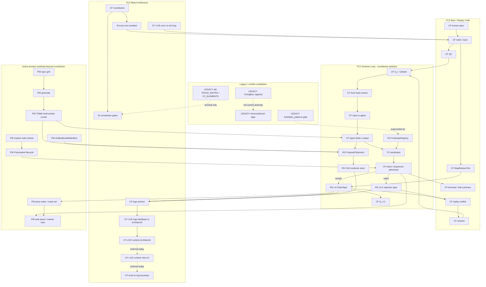

# TuringOS v4 Architecture Liveness Map - 2026-05-25

Authority:
- Constitution source: `constitution.md`
- FC1 block: `constitution.md:455-509`
- FC2 block: `constitution.md:571-660`
- FC3 block: `constitution.md:826-870`

This file is a derived audit artifact. It is not a fourth flowchart and it
does not amend the constitution. Its purpose is to keep the architecture honest:
the three constitutional flowcharts are the necessary skeleton, while practical
modules that exceed the constitution are listed only if they are active,
non-contradictory, and needed for the current real-world system.

Status vocabulary:
- `CF`: constitutional flowchart element
- `RS`: required substrate discovered during implementation
- `SI`: support invariant that protects constitutional behavior
- `PW`: product workload module
- `LEGACY`: old surface or zombie candidate
- `MISSING`: constitutional flowchart element not yet live in production

## Architecture Graph



## Constitutional Skeleton Status

| Flowchart | Element | Status | Production evidence | Closure if not live |
|---|---|---:|---|---|
| FC1 | `Q_t` / `Q_{t+1}` typed state | LIVE | `QState`, `Sequencer::q_snapshot`, L4 state roots | none |
| FC1 | `rtool -> input` | LIVE | `fc1_rtool_input_snapshot_is_chain_cas_derived` wires `TuringBus::snapshot` to the typed sequencer read path and verifies parent-child context from L4 + CAS `ProposalTelemetry` while legacy shadow `Tape` stays empty | none for the tested typed read-view path |
| FC1 | agent output | PARTIAL | real generate path emits typed WorkTxs and CAS proposal evidence | real-world LLM workload is active but not itself a complete FC proof |
| FC1 | predicates | LIVE | registry-backed predicate verification in sequencer | external proof-heavy predicates still need per-kind expansion |
| FC1 | `wtool -> Q_{t+1}` | LIVE | accepted WorkTx enters L4; real WorkTx read/write sets bind ProposalTelemetry and task output | none |
| FC1 | predicate failure | LIVE | rejected WorkTx enters L4.E without advancing L4 logical_t | none |
| FC2 | boot / Q0 | LIVE | `build_chaintape_sequencer`, activation tx, `initial_q_state.json` | none |
| FC2 | replay / resume | LIVE | `verify_chaintape`, `replay_full_transition_with_predicate_binding`, `resume_existing_chain` | none |
| FC2 | map-reduce tick | LIVE | `MapReduceTickTx`, `SystemEmitCommand::MapReduceTick`, boot `activate_map_reduce_tick_for_boot`, replay prefix verification | none |
| FC2 | halt summary | LIVE | `TerminalSummaryTx`, `RunOutcome`, `runs_t` | none |
| FC3 | constitution/logs boundary | PARTIAL | trust-root verification, ChainTape, CAS, L4.E | typed tools-to-log liveness probe still needed |
| FC3 | ArchitectAI / Veto-AI | LIVE | `ArchitectProposalTx`, `VetoDecisionTx`, `ArchitectCommitTx` with CAS capsules, runtime system emit, PASS-only commit path, replay verification | none for typed runtime meta-role path |
| FC3 | logs feedback to ArchitectAI | LIVE | `LogFeedbackArchiveTx` / `TxKind::LogFeedbackArchive = 21`, `ArchitectFeedbackCapsule` CAS schema `fc3.architect_feedback.v1`, system-only signing, L4/L4.E/CAS/constitution prefix roots, replay checks, and runtime proposal continuation in `constitution_fc3_closure` | none for the typed feedback edge |
| FC3 | error re-init loop | LIVE | `ReinitRequestTx` / `ReinitBootTx`, ErrorHalt `TerminalSummaryTx` trigger, `ReinitReasonCapsule` CAS schema `fc3.reinit_reason.v1`, replayed boot state root, no old evidence rewrite | none for the typed re-init edge |

## Extra Active Modules

| Module | Class | Why it is kept | Flowchart relationship |
|---|---:|---|---|
| CAS store | RS | Reconstructs ProposalTelemetry, artifacts, predicates, rejection payloads, and replay evidence | supports FC1/FC2/FC3 tape truth |
| Git-backed L4 ChainTape | RS | Makes accepted transitions and boot MapReduceTick replayable and hash-addressed | concrete tape implementation for FC1/FC2 |
| L4.E rejection tape | RS | Records failed admissions without advancing accepted state | necessary fail-closed branch for FC1 |
| PredicateRegistry | RS | Makes predicates executable ground truth, not runner-stamped belief | FC1 predicate boundary |
| AgentKeypairRegistry and pinned system keys | RS | Distinguishes agent signatures from system emissions | protects FC1/FC2 typed tx authority |
| BootPredicateManifest and activation tx | RS | Makes boot-time predicate root tape-visible | FC2 boot and FC1 predicate replay |
| ProposalTelemetry | RS | Binds WorkTx to CAS-backed proposal evidence and artifact CID | FC1 output provenance |
| Trust-root verification | SI | Prevents runtime from silently loading non-ratified constitution/trust-root bytes | FC3 constitution boundary |
| Source-alignment and liveness gates | SI | Prevent derived matrices from becoming false authority | protects all FC mappings |
| PromptCapsule / AttemptTelemetry | SI | Carries prompt/read evidence without exposing raw private diagnostics | supports FC1 input and FC3 log hygiene |
| Role-scoped views and raw-log shielding | SI | Keeps agent read views bounded and reconstructable | supports FC3 tools/log boundary |
| TDMA runner / memory kernel / distiller | PW | Real workload machinery for iterative proof/code generation | exercises FC1 but is not a constitutional node |
| Spec grill and generate pipeline | PW | Current real-user product path | feeds FC1 agent work and FC2 booted workspace |
| ArtifactBundleManifest | PW | User-visible generated deliverable, stored through CAS | product output attached to FC1 WorkTx evidence |
| Polymarket lifecycle | PW | Market workload: `MarketSeed -> Verify -> FinalizeReward -> EventResolve` | workload over FC1/FC2 tape substrate |
| Price index / mask set / market view | PW | Replay-derived UI and market state projection | derived view, not source of truth |
| Market order tickets | PW | Voluntary trade-intent evidence for market workloads | product sidecar; must remain CAS/tape-derived |
| Legacy `TuringBus::append` | LEGACY | Retained compatibility surface, not typed authority | zombie candidate if future callers rely on it |
| Legacy forbidden-pattern predicate gate | LEGACY | Superseded by executable PredicateRegistry | should not be cited as FC1 predicate proof |
| Old FC extraction files / old trace matrices | LEGACY | Historical derived views only | forbidden as current topology authority |

## Current Non-Negotiable Boundary

1. FC3 ArchitectAI/Veto-AI are live runtime meta-role surfaces. External PR
   reviews may still audit development work, but they no longer count as FC3
   node coverage.
2. FC3 logs-feedback, proposal, veto, commit, and re-init semantics are now
   live as typed, system-emitted L4 facts with CAS and replay binding.
3. FC1 rtool/input is live for the tested typed read-view path:
   `TuringBus::snapshot` reconstructs input context from ChainTape/CAS-backed
   proposal telemetry rather than the legacy shadow `Tape`. Product-specific
   prompt assembly remains workload coverage, not a separate flowchart gap.

## Verification Hooks

Current tests that keep this map falsifiable:

```bash
cargo test --test constitution_fc3_closure
cargo test --test constitution_flowchart_source_alignment
cargo test --test constitution_flowchart_livenow
cargo test --test tb_7_authoritative_routing
cargo test --test generate_emits_work_tx_smoke
cargo test --test constitution_matrix_drift
bash scripts/run_constitution_gates.sh
```
